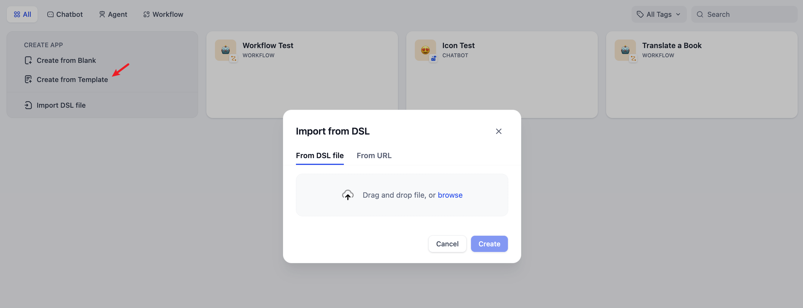

# Create Application

You can create applications in Dify's studio in three ways:

* Create based on an application template (recommended for beginners)
* Create a blank application
* Create application via DSL file (Local/Online)

### Creating an Application from a Template

When using Dify for the first time, you might be unfamiliar with creating applications. To help new users quickly understand what types of applications can be built on Dify, the prompt engineers from the Dify team have already created high-quality application templates for multiple scenarios.

You can select "Studio" from the navigation menu, then choose "Create from Template" in the application list.

<figure><figcaption><p>Create an application from a template</p></figcaption></figure>

Select any template and click **Use this template.**

<figure><figcaption><p>Dify application templates</p></figcaption></figure>

### Creating a New Application

If you need to create a blank application on Dify, you can select "Studio" from the navigation and then choose "Create from Blank" in the application list.

When creating an application for the first time, you might need to first understand the [basic concepts](./#application\_type) of the four different types of applications on Dify: Chatbot, Text Generator, Agent and Workflow.

<figure><figcaption><p>Create a blank application</p></figcaption></figure>

When selecting a specific application type, you can customize it by providing a name, choosing an appropriate icon(or uploading your favorite image as an icon), and writing a clear and concise description of its purpose. These details will help team members easily understand and use the application in the future.

### Creating from a DSL File


Dify DSL is an AI application engineering file standard defined by Dify.AI. The file format is YML. This standard covers the basic description of the application, model parameters, orchestration configuration, and other information.


#### Import local DSL file

If you have obtained a template (DSL file) from the community or others, you can choose "Import DSL File" from the studio. After importing, all configuration information of the original application will be loaded directly.

<figure><figcaption><p>Create an application by importing a DSL file</p></figcaption></figure>

#### Import DSL file from URL

You can also import DSL files via a URL, using the following link format:

```URL
https://example.com/your_dsl.yml
```

<figure><figcaption><p>Create an application by importing a DSL file</p></figcaption></figure>
