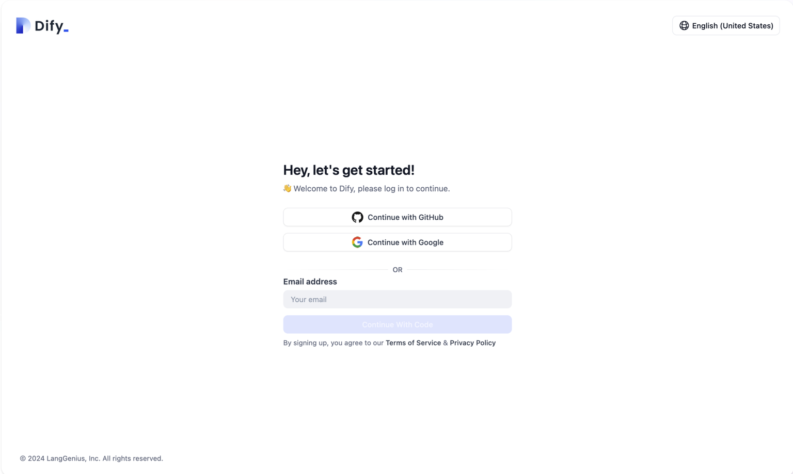

# Personal Account Management

## Login Methods

The login methods supported by different versions of Dify are as follows:

<table><thead><tr><th width="166">Version</th><th>Login Method</th></tr></thead><tbody><tr><td>Community</td><td>Email and password</td></tr><tr><td>Cloud</td><td>GitHub account authorization, Google account authorization, email and verification code</td></tr></tbody></table>

> Note: For Dify Cloud Service, if the email associated with a GitHub or Google account is the same as the email used to log in with a verification code, the system will automatically link them as the same account, avoiding the need for manual binding and preventing duplicate registrations.

<figure><figcaption></figcaption></figure>

## Modifying Personal Information

To update your personal account information:

1. Navigate to the Dify team homepage
2. Click on your avatar in the upper right corner
3. Select **"My Account"**

You can modify the following details:

* Avatar
* Username
* Email
* Password

> Note: The password reset feature is only available in the Community Version.

<figure><figcaption></figcaption></figure>

### Integrations

You can link your GitHub and Google accounts as login methods for your Dify team. Click on your avatar in the upper right corner of the Dify team homepage, then click **"Integrations"** to set up these links.

### Changing Display Language

To change the display language, click on your avatar in the upper right corner of the Dify team homepage, then click **"Language"**. Dify supports the following languages:

* English
* Simplified Chinese
* Traditional Chinese
* Portuguese (Brazil)
* French (France)
* Japanese (Japan)
* Korean (South Korea)
* Russian (Russia)
* Italian (Italy)
* Thai (Thailand)
* Indonesian
* Ukrainian (Ukraine)

Dify welcomes community volunteers to contribute additional language versions. Visit the [GitHub repository](https://github.com/langgenius/dify/blob/main/CONTRIBUTING.md) to contribute!

### Deleting Personal Account

For team data security considerations, self-service online deletion of personal account information is not currently supported. If you need to completely delete your account, please include the following information in an email and send it to support@dify.ai.

```
Delete account: your-email
```

<figure><figcaption><p>Delete personal account</p></figcaption></figure>
