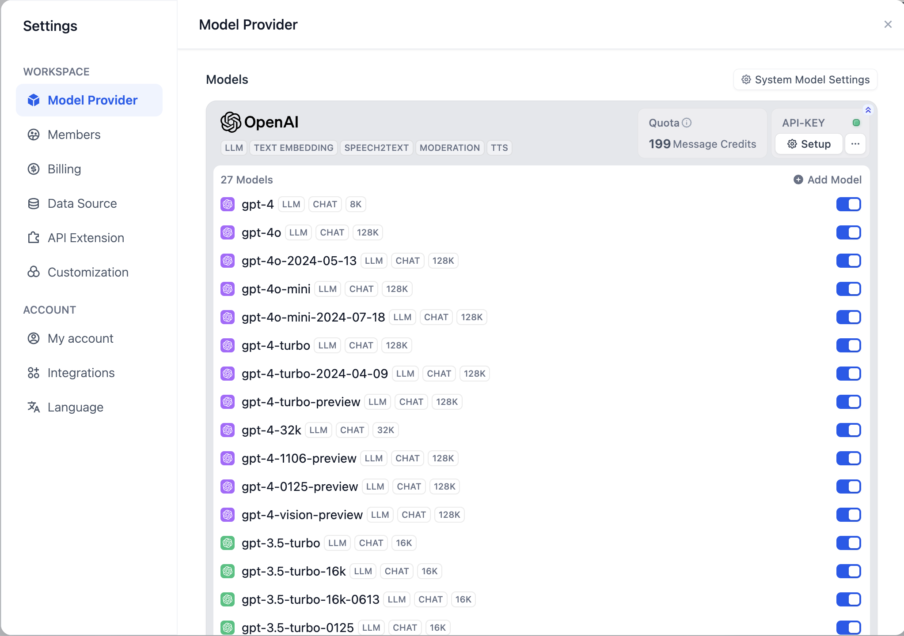
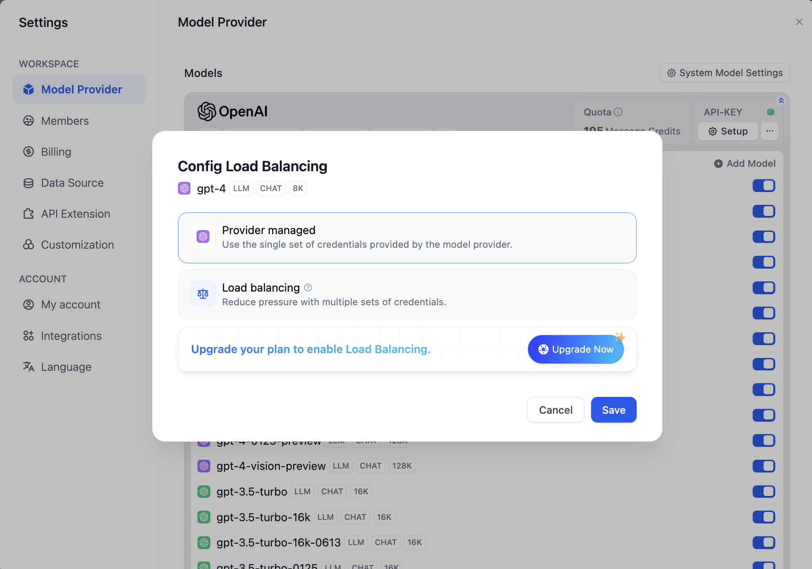

# Load Balancing

Model rate limits are restrictions imposed by model providers on the number of times users or customers can access API services within a specified time frame. These limits help prevent API abuse or misuse, ensure fair access for all users, and control the overall load on the infrastructure.

In enterprise-level large-scale model API calls, high concurrent requests can exceed rate limits and affect user access. Load balancing can distribute API requests across multiple API endpoints, ensuring all users receive the fastest response and the highest model invocation throughput, thereby ensuring stable business operations.

You can enable this feature by navigating to **Model Provider -- Model List -- Configure Model Load Balancing** and adding multiple credentials (API keys) for the same model.

<figure><figcaption>
Model Load Balancing
</figcaption></figure>


Model load balancing is a paid feature. You can enable it by [subscribing to SaaS paid services](../../getting-started/cloud.md#subscription-plan) or purchasing the enterprise edition.


The default API key is the credential added when initially configuring the model provider. You need to click **Add Configuration** to add different API keys for the same model to use the load balancing feature properly.

<figure><figcaption>
Configuring Load Balancing
</figcaption></figure>

**At least one additional model credential** must be added to save and enable load balancing.

You can also **temporarily disable** or **delete** configured credentials.

<figure><figcaption></figcaption></figure>

Once configured, all models with load balancing enabled will be displayed in the model list.

<figure><figcaption>
Enabling Load Balancing
</figcaption></figure>


By default, load balancing uses the Round-robin strategy. If the rate limit is triggered, a 1-minute cooldown period will be applied.


You can also configure load balancing from **Add Model**, following the same process as above.

<figure><figcaption>
Configuring Load Balancing from Add Model
</figcaption></figure>