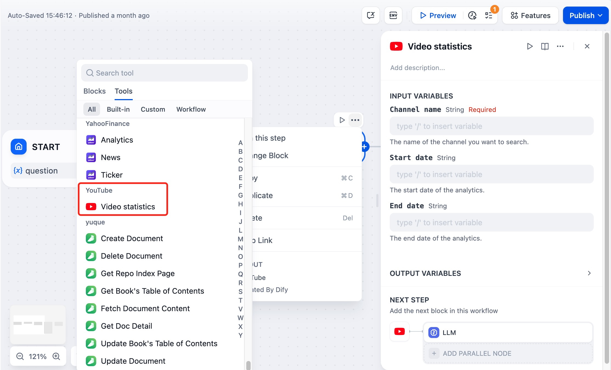
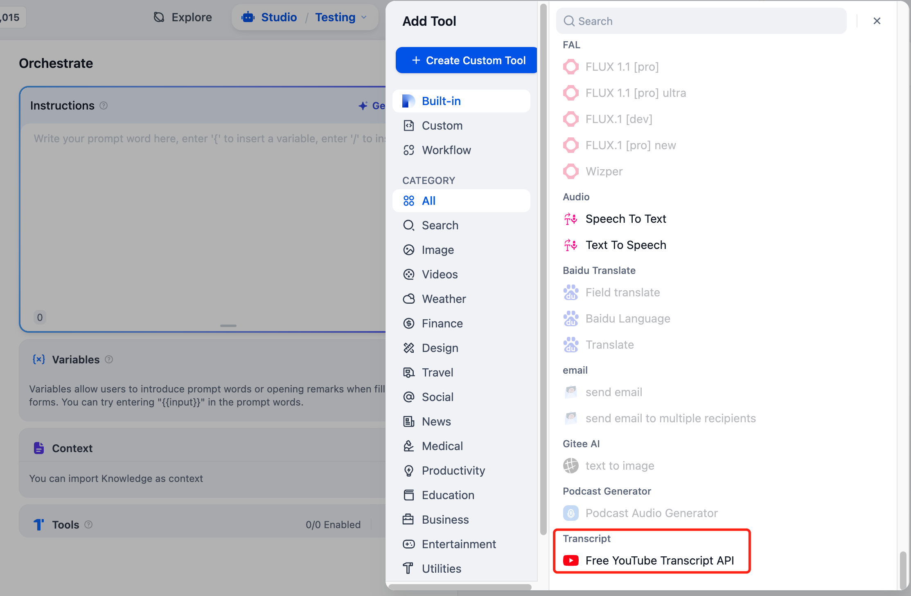

# Youtube

> Tool author @Dify.

[Youtube](https://www.youtube.com/) is the biggest online video sharing platform. Currently Dify.ai has two relevant tools `Video Statisctics` and `Free YouTube Transcript API` to analysis the videos' information by entering the url or keyword.  

## 1. Ensure that you allow to use the Google Cloud Service

> If you don't have an account, go to the [Google credential site](https://console.cloud.google.com/apis/credentials) and follow their instruction to create an account.

If you have the account, go to the APIs & Services page and click `Create credentials -> API key` to create an API key.

Follow the step and click `Enabled APIs and services -> YouTube Data API v3` to enable the Youtube Data API.

## 2. Setup the Youtube API in Dify Tool page

Back to the [Dify Tools page](https://cloud.dify.ai/tools) and open the Youtube API card, fill in the API from Step 1 to get the authorization.

## 3. Using the tool

You can use the Youtube tool in the following application types.

* **Chatflow / Workflow applications**

Both Chatflow and Workflow applications support adding `Video statistics` nodes. 

* **Agent applications**

Add the `Free YouTube Transcript API` tool in the Agent application, then enter relevant commands to invoke this tool.

