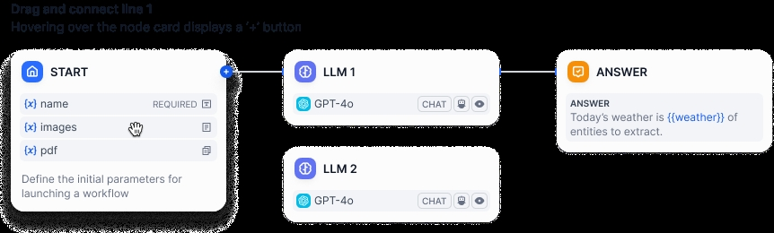
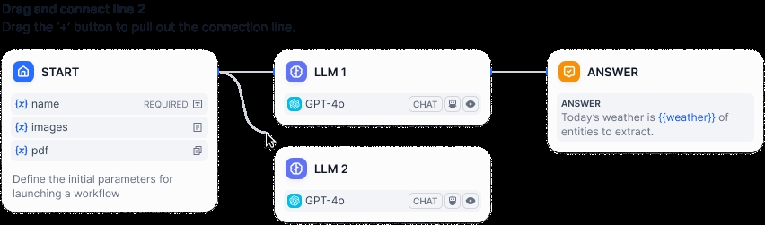
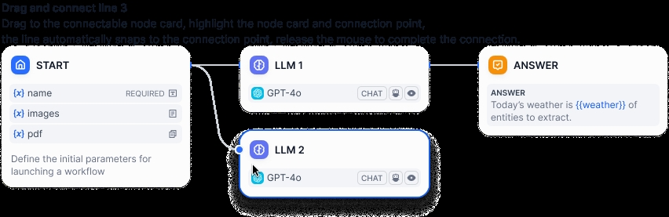

# Orchestrate Node

Both Chatflow and Workflow applications support node orchestration through visual drag-and-drop, with two orchestration design patterns: serial and parallel.

## Serial Node Design

This structure requires nodes to execute in a preset order, with each node waiting for the previous one to complete and output results before starting its work. This helps ensure tasks are executed in a logical sequence.

For example, in a "Novel Generation" Workflow App that uses serial design, after the user inputs the novel style, rhythm, and characters, the LLM completes the novel outline, plot, and ending in sequence. Each node works based on the output of the previous node, ensuring consistency in the novel's style.

### Designing a Serial Structure

Click the `+` sign between two nodes to add a serial node in between. Connect the nodes in sequence by linking them, and finally, converge the lines to the "End" node to complete the design.

### Viewing Serial Structure Application Logs

Logs in a serial structure application will display the operation of each node in order. Click "View Logs - Tracing" in the upper right corner of the dialog box to see the complete workflow process, including input/output, token consumption, and runtime for each node.

## Parallel Node Design

This design pattern allows multiple nodes to execute simultaneously, with the preceding node able to trigger multiple nodes within the parallel structure at the same time. Nodes within the parallel structure have no dependencies and can execute tasks simultaneously, better improving the efficiency of node task execution.

For example, in a translation workflow application with parallel design, after the user inputs the source text to trigger the workflow, the nodes within the parallel structure will receive the transfer instruction from the preceding node simultaneously, carrying out translation tasks in multiple languages concurrently, reducing the task processing time.

### Parallel Structure Design

You can refer to the following four methods to create a parallel structure by adding new nodes or dragging.

**Method 1**
Hover the mouse over a node to display the + button, which supports adding multiple nodes, automatically forming a parallel structure after creation.

**Method 2**
Drag the + button at the end of a node to create a line forming a parallel structure.

**Method 3**
orchestrate-node-parallel-design-method-1If there are multiple nodes on the canvas, form a parallel structure through visual dragging.

**Method 4**
In addition to directly adding parallel nodes or visually dragging to form a parallel structure on the canvas, you can also add parallel nodes in the "Next Step" of the node's right-side list to automatically generate a parallel structure.

Notes:
- The downstream node of a parallel structure can be any node;

- In Workflow type applications, a unique "end" node needs to be determined;

- Chatflow type applications support multiple "answer" nodes. All parallel structures in this type of application need to configure "answer" nodes at the end to properly output the content from each parallel structure;

- All parallel structures will run simultaneously; nodes within the parallel structure output results after completing their tasks, with no order relationship in output. The simpler the parallel structure, the faster the output of results.

[图片]

### Designing Parallel Structure Applications

The following will showcase four common parallel node design ideas.

1. Normal Parallel

Normal parallel refers to the Start | Parallel Structure | End three-layer relationship, which is also the smallest unit of parallel structure. This structure is intuitive, allowing the workflow to execute multiple tasks simultaneously after user input.

The upper limit for parallel branches is 10.

[图片]

2. Nested Parallel

Nested parallel refers to the Start | Multiple Parallel Structures | End multi-layer relationship. It is suitable for more complex workflows, such as needing to request an external API within a certain node and simultaneously passing the returned results to downstream nodes for processing.

A workflow supports up to 3 layers of nesting relationships.

[图片]

3. Conditional Branch + Parallel

Parallel structures can also be used in conjunction with conditional branches.

[图片]

4. Iteration Branch + Parallel

Iteration branches also support orchestrating parallel structures to accelerate the execution efficiency of nodes within the iteration.

[图片]

### Viewing Parallel Structure Application Logs

The operation logs of applications containing parallel structures support tree-like structure display. You can collapse parallel node groups to better view the operation logs of each node.
