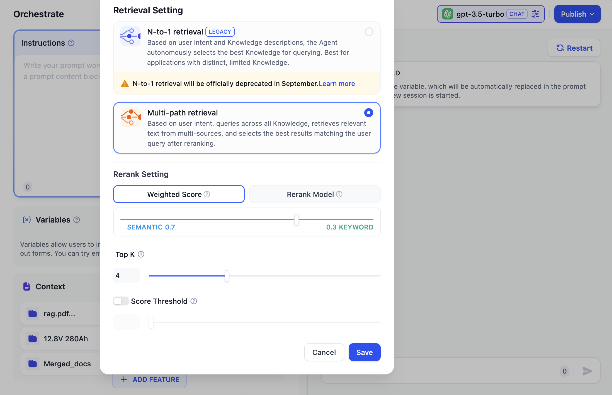

# Retrieval Mode

When users build AI applications with multiple knowledge bases, Dify's retrieval strategy will determine which content will be retrieved.

<figure><figcaption>
retrieval Mode Settings
</figcaption></figure>

<!-- ### N-of-1 retrieval Mode

Based on user intent and dataset descriptions, the Agent autonomously selects the single most relevant dataset to query for related text. This mode is suitable for applications with highly distinct datasets and fewer datasets. The N-of-1 retrieval mode relies on the model's inference capability, requiring the model to choose the most appropriate dataset based on user intent. During inference, datasets are treated as tools by the Agent, selected through intent inference, with the tool descriptions being the dataset descriptions.

When users upload datasets, the system automatically creates a summary description for the dataset. To achieve optimal retrieval results in this mode, you can review the system-generated summary description in “Datasets -> Settings -> Dataset Description” and ensure it clearly summarizes the dataset content.

Below is the technical flowchart for the N-of-1 retrieval mode:

<figure><figcaption>
N-of-1 retrieval
</figcaption></figure>

Hence, if there are too many datasets or if the dataset descriptions are not sufficiently distinct, the retrieval effectiveness of this mode may be affected. This mode is more suitable for applications with fewer datasets.

Tip: OpenAI Function Call now supports multiple tool calls. Dify will upgrade this mode to "N-of-M retrieval" in future versions. -->

### Retrieval Setting

Matches all datasets based on user intent, querying related text fragments from multiple datasets simultaneously. After a re-ranking step, the best results matching the user query are selected from the multi-path query results, requiring a configured Rerank model API. In multi-path retrieval mode, the retriever searches for text content related to the user query across all datasets associated with the application merge the relevant document results from multi-path retrieval and re-ranks the retrieved documents semantically using the Rerank model.

In multi-path retrieval mode, it's recommended that the Rerank model be configured.

Below is the technical flowchart for the multi-path retrieval mode:

<figure><figcaption>
Multi-Path retrieval
</figcaption></figure>

Since multi-path retrieval mode does not rely on the model's inference capability or dataset descriptions, it can achieve higher-quality retrieval results when retrieving across multiple datasets. Additionally, incorporating a re-ranking step can effectively improve document retrieval effectiveness. Therefore, when creating knowledge base Q&A applications associated with multiple datasets, we recommend configuring the retrieval mode as multi-path retrieval.
