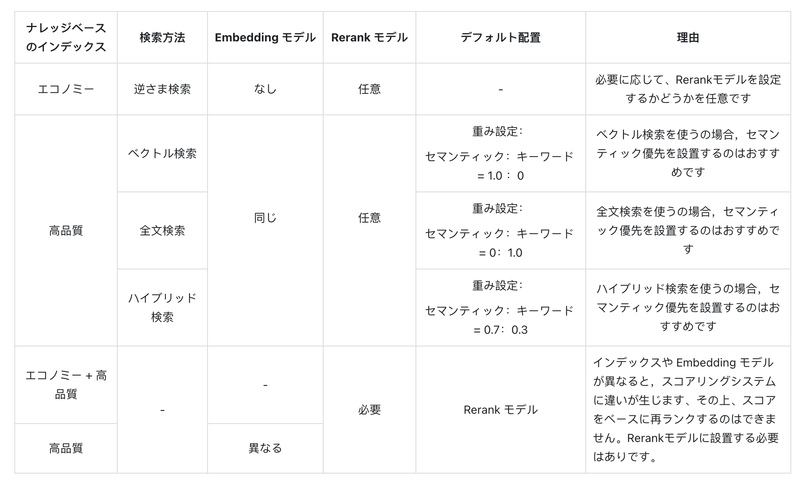

# アプリ内でのナレッジベースの統合

### 1 ナレッジベースの引用プロセス

ナレッジベースは、大言語モデルに対して外部知識を提供し、ユーザーの質問に正確に回答するために使用されます。Difyの[すべてのアプリタイプ](../application-orchestrate/#application_type)内で作成されたナレッジベースを関連付けることができます。

チャットアシスタントを例にすると、以下の手順で進めます：

1. **スタジオ -- アプリを作成 -- チャットアシスタントを作成**に進む
2. **コンテキスト設定**に進み、**追加**をクリックし、作成済みのナレッジベースを選択
3. **コンテキスト設定 -- パラメータ設定**内で**召回策略**を設定
4. **機能追加**内で**引用と帰属**をオンにする
5. **デバッグとプレビュー**内でナレッジベース関連のユーザー質問を入力してデバッグ
6. デバッグが完了したら、**保存して公開**し、AIナレッジベースQ&Aアプリケーションとして公開

***

### ナレッジベースの関連付けとリコールモードの設定

現在のアプリケーションのコンテキストが複数のナレッジベースに関連している場合、検索結果をより正確にするためにリコールモードを設定する必要があります。**コンテキスト→パラメータ設定→リコール設定** に進み、ナレッジベースのリコールモードを選択します。

<!-- #### Nから1への関連付け（レガシー）

Nから1への関連付けは、Function Call/ReActによって駆動され、各関連するナレッジベースがツール関数として機能します。LLM（大規模言語モデル）は、ユーザーの問題に最も適した1つのナレッジベースを選択してクエリを実行します。**推論の根拠は、ユーザーの問題とナレッジベースの説明の意味の一致度** に基づいています。

動作原理は以下の通りです：

<figure><figcaption></figcaption></figure>

例：アプリケーションAのコンテキストには、K1、K2、K3の3つのナレッジベースが関連付けられています。Nから1への関連付け戦略を使用すると、ユーザーがアプリ内で問い合わせを行った際に、LLMはこれら3つのナレッジベースの説明を検索し、最も適切なナレッジベースを選択してその内容を用いて検索を実行します。

<figure><figcaption></figcaption></figure>

この方法では[Rerankモデル](https://docs.dify.ai/v/ja-jp/learn-more/extended-reading/retrieval-augment/rerank)の設定が不要ですが、このリコール戦略は1つのナレッジベースにのみ一致し、マッチング対象のナレッジベースはLLMがナレッジベースの説明を理解する能力に大きく依存しているため、検索されたナレッジベースが不完全で正確でない可能性があります。その結果、高品質なクエリ結果を提供できない可能性があります。

9月以降、この戦略は自動的に**複数リコール**に置き換えられる予定ですので、事前に変更を行ってください。

Nから1モードでは、リコール効果には主に3つの要因が影響します：

* **システムの推論モデルの能力** 一部のモデルはFunction Call/ReActの命令に対する遵守度が安定していません。
* **ナレッジベースの説明の明確さ** 説明内容は、LLMがユーザーの問題と関連するナレッジベースを推論するのに影響します。
* **ナレッジベースの数** ナレッジベースが多すぎると、LLMの推論の精度に影響し、同時に推論モデルのコンテキストウィンドウの長さを超える可能性があります。

**Nから1モードの関連付け効果を向上させる方法：**

- より良いシステム推論モデルを選択し、できるだけ少ない数のナレッジベースを関連付け、正確なナレッジベースの説明を提供します。

- ナレッジベースに文書内容をアップロードする際、システム推論モデルが自動的にナレッジベースの要約説明を生成します。このモードで最適なリコール効果を得るためには、「ナレッジベース→設定→ナレッジベースの説明」で、システムがデフォルトで作成した要約説明を確認し、その内容がナレッジベースの内容を明確に要約できているかを確認することができます。 -->

#### 検索設定

複数リコールモードでは、検索器はアプリに関連付けられたすべてのナレッジベースから、ユーザーの問題に関連するテキスト内容を検索します。そして、複数リコールの関連文書結果を統合します。以下は複数リコールモードの技術フローチャートです：

<figure><figcaption></figcaption></figure>

ユーザーの意図に基づいて、すべての **「コンテキスト」** に追加されたナレッジベースを同時に検索し、関連するテキスト断片を複数のナレッジベースからクエリし、ユーザーの問題に最も一致する内容を選択します。最適なコンテンツをRerank戦略で見つけてユーザーに回答します。この方法はより科学的な検索原理です。

<figure><figcaption></figcaption></figure>

例：アプリAのコンテキストには、K1、K2、K3 の3つのナレッジベースが関連付けられています。ユーザーが問い合わせを入力すると、3つのナレッジベースで検索を行い、複数の内容をまとめます。最適な内容を見つけるためには、Rerank戦略を使用してユーザーの問題に最も関連する内容を特定し、結果をより正確で信頼性の高いものにします。

実際の質疑応答シーンでは、各ナレッジベースのコンテンツの出典や検索方法が異なる場合があります。複数の混合コンテンツが返される検索に対して、[Rerank戦略](https://docs.dify.ai/v/ja-jp/learn-more/extended-reading/retrieval-augment/rerank)はより科学的なコンテンツの並べ替えメカニズムです。これにより、候補コンテンツリストをユーザーの問題に一致させ、複数の知識間の結果の順序を改善し、最も一致するコンテンツを見つけて回答の質とユーザーエクスペリエンスを向上させることができます。

Rerankの使用コストとビジネス要件を考慮すると、複数リコールモードは次の2つのRerank設定を提供します：

#### 重み設定

この設定には外部のRerankモデルの構成は不要で、コンテンツの再並べ替えに**追加コストは発生しません**。セマンティクスまたはキーワードの重み比率を設定します。

- **セマンティック値が1の場合**

  セマンティック検索モードが有効になります。このモードでは、埋め込みモデルを利用して、クエリに正確な単語がナレッジベースに存在しない場合でも、ベクトル距離を計算することで検索の精度を向上させ、適切なコンテンツを返すことができます。また、複数言語のコンテンツを扱う場合には、セマンティック検索が異なる言語間の意味を把握し、より正確なクロス言語検索結果を提供します。

- **キーワード値が1の場合**

  この場合、キーワード検索モードが有効になります。ユーザーが入力した情報テキストがナレッジベース全体と一致し、ユーザーが正確な情報や用語を把握している場合に適しています。この方法は計算リソースを少なく消費し、大量の文書を迅速に検索するのに適しています。

- **カスタムキーワードとセマンティックの重み**

  セマンティック検索またはキーワード検索モードのいずれかを選択する代わりに、柔軟なカスタム重み設定も利用可能です。両者の重みを調整し続けることで、ビジネスシナリオに最も適した重み比率を見つけることができます。

##### Rerankモデル

Rerankモデルは外部のスコアリングシステムで、ユーザーの質問と各候補文書の関連性スコアを計算します。これにより、セマンティックソートの結果が改善され、関連性に基づいて高い順に並べ替えられた文書リストが返されます。

この方法には追加のコストが発生しますが、ナレッジベースのコンテンツが複雑な場合に特に適しています。セマンティッククエリとキーワードマッチングのコンテンツが混在している場合や、複数言語のコンテンツが含まれる場合に優れた結果を提供します。

> より詳細な情報は[リコール拡張](https://docs.dify.ai/v/ja-jp/learn-more/extended-reading/retrieval-augment/rerank)メカニズムをご覧ください。

Difyは現在、複数のRerankモデルをサポートしており、"モデルサプライヤー"ページでRerankモデル（例：Cohere、Jina AIなど）のAPIキーを入力することができます。

<figure><figcaption>
モデルサプライヤー内でRerankモデルを設定
</figcaption></figure>

##### 調整可能なパラメータ

- **TopK**

  ユーザーの質問に最も類似したテキストセグメントを選択するために使用されます。システムはモデルの選択に基づいてコンテキストウィンドウサイズを動的に調整し、セグメントの数を増やします。数値が高いほど、リコールされるテキストセグメントの数が増加します。

- **スコアの閾値**

  テキストセグメントの選択に使用される類似性の閾値を設定します。ベクトル検索の類似性スコアは、設定したスコアを超える必要があり、数値が高いほどリコールされるテキストの数が減少します。

複数のリコールモードを利用することで、高品質なリコール効果を得ることができるため、リコールモードを複数のリコールモードに設定することを強くお勧めします。

### よくある質問

1. **複数のリコールモードでのRerank設定の選択方法は？**

ユーザーが正確な情報や用語を知っている場合は、キーワード検索を使用して一致する結果を正確に取得できるため、「重み設定」の**キーワード優先モード**をお勧めします。

ナレッジベースに正確な単語が表示されていない場合や、クロス言語クエリがある場合は、「重み設定」の**セマンティック優先モード**を選択することをお勧めします。

ビジネスユーザーが実際の質問シナリオに詳しく、セマンティックまたはキーワードの比率を積極的に調整したい場合は、「重み設定」の**カスタムモード**を選択することをお勧めします。

ナレッジベースのコンテンツが複雑であり、セマンティックまたはキーワードのシンプルな条件で一致させることができない場合、かつより正確な回答が必要で追加料金を支払うことを望む場合は、コンテンツ検索に**Rerankモデル**を使用することをお勧めします。

2. **「重み設定」が見つからない、またはRerankモデルの設定が必要な場合、どのように対処すれば良いですか？**

以下は、複数の召回方法が知識ベース検索に与える影響を示します：

3. **複数の知識ベースを引用する際、「重み設定」を調整できず、エラーが表示される場合はどう対処すれば良いですか？**

この問題が発生するのは、引用されている複数の知識ベースで使用されている埋め込みモデルが一致しないためです。検索コンテンツの競合を避けるためには、以下の推奨解決策を試みてください。「モデルプロバイダー」で設定を行い、Rerankモデルを有効にするか、知識ベースの検索設定を統一してください。

4. **複数の召回方法が使用されている場合、「重み設定」オプションが見つからず、Rerankモデルしか表示されない理由は何ですか？**

知識ベースが「エコノミー」モードのインデックスモードを使用しているかどうかを確認してください。その場合は、「ハイクオリティ」モードのインデックスモードに切り替えてください。