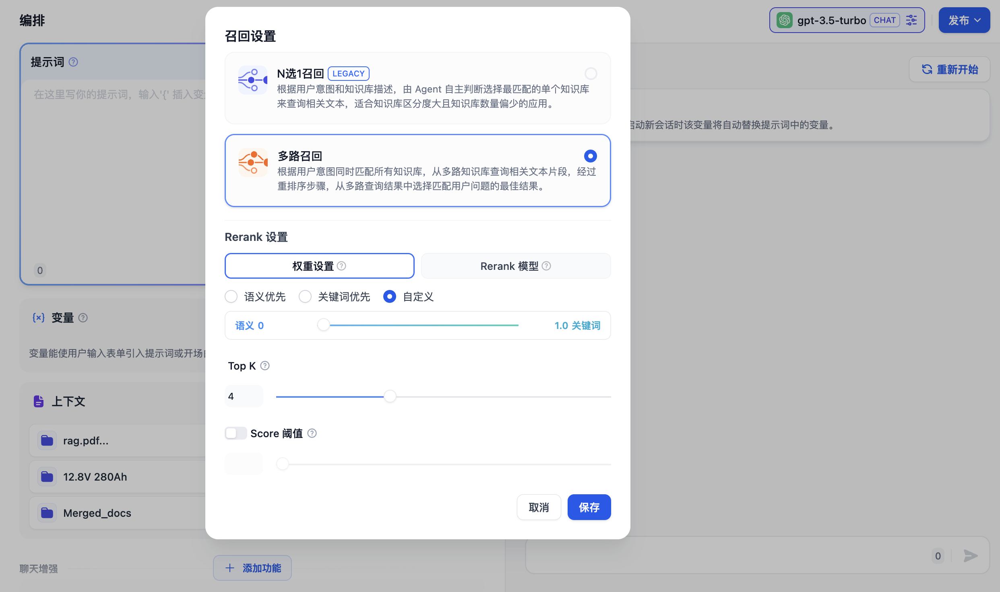
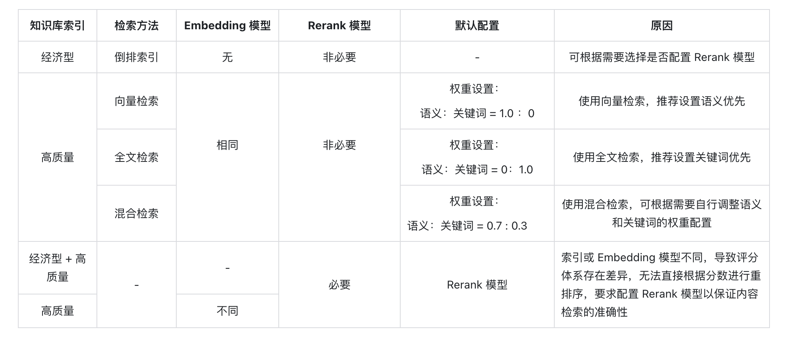

# 在应用上下文内引用知识库

### 在应用内引用知识库

知识库可以作为外部知识提供给大语言模型用于精确回复用户问题，你可以在 Dify 的[所有应用类型](../application-orchestrate/#application_type)内关联已创建的知识库。

以聊天助手为例，使用流程如下：

1. 进入 **工作室 -- 创建应用 --创建聊天助手**
2. 进入 **上下文设置** 点击 **添加** 选择已创建的知识库
3. 在 **上下文设置 -- 参数设置** 内配置**召回策略**
4. 在 **添加功能** 内打开 **引用和归属**&#x20;
5. 在 **调试与预览** 内输入与知识库相关的用户问题进行调试
6. 调试完成之后**保存并发布**为一个 AI 知识库问答类应用

***

### 关联知识库并指定召回模式

如果当前应用的上下文涉及多个知识库，需要设置召回模式以使得检索的内容更加精确。进入 **上下文 -- 参数设置 -- 召回设置**，选择知识库的召回模式。

#### N 选 1 召回（Legacy）

N 选 1 召回由 Function Call/ReAct 进行驱动，每一个关联的知识库作为工具函数，LLM 会自主选择与用户问题最匹配的 1 个知识库来进行查询，**推理依据为用户问题与知识库描述的语义的匹配程度**。

原理图如下：

<figure><figcaption></figcaption></figure>

举例：A 应用的上下文关联了 K1、K2、K3 三个知识库。使用 N 选 1 召回策略后，用户在应用内输入问题后，LLM 将检索这三个知识库的描述，匹配某个最适合的知识库并使用其中的内容进行检索。

虽然此方法无需配置 [Rerank](https://docs.dify.ai/v/zh-hans/learn-more/extended-reading/retrieval-augment/rerank) 模型，但该召回策略仅匹配单个知识库，且匹配的目标知识库严重依赖于 LLM 对于知识库描述的理解，检索匹配知识库时可能会存在不合理的判断，导致检索到的结果可能不全面、不准确，从而无法提供高质量的查询结果。

自 9 月份后，该策略将会被自动替换为**多路召回**，请提前进行修改。

在 N 选 1 模式下，召回效果主要受三个因素影响：

* **系统推理模型的能力** 部分模型对于 Function Call/ReAct 的指令遵循程度不稳定
* **知识库描述是否清晰** 描述内容会影响 LLM 对用户问题与相关知识库的推理
* **知识库的个数** 知识库过多会影响 LLM 的推理精确性，同时可能会超出推理模型的上下文窗口长度。

**提升 N 选 1 模式推荐效果的方法：** 

- 选择效果更好的系统推理模型，关联尽量少的知识库，提供精确的知识库描述。

- 在知识库内上传文档内容时，系统推理模型将自动为知识库生成一个摘要描述。为了在该模式下获得最佳的召回效果，你可以在 “知识库->设置->知识库描述” 中查看到系统默认创建的摘要描述，并检查该内容是否可以清晰的概括知识库的内容。

#### 多路召回（推荐）

在多路召回模式下，检索器会在所有与应用关联的知识库中去检索与用户问题相关的文本内容，并将多路召回的相关文档结果合并，以下是多路召回模式的技术流程图：

<figure><figcaption></figcaption></figure>

根据用户意图同时检索所有添加至 **“上下文”** 的知识库，在多个知识库内查询相关文本片段，选择所有和用户问题相匹配的内容，最后通过 Rerank 策略找到最适合的内容并回答用户。该方法的检索原理更为科学。

<figure><figcaption></figcaption></figure>

举例：A 应用的上下文关联了 K1、K2、K3 三个知识库，当用户输入问题后，将在三个知识库内检索并汇总多条内容。为确保能找到最匹配的内容，需要通过 Rerank 策略确定与用户问题最相关的内容，确保结果更加精准与可信。

在实际问答场景中，每个知识库的内容来源和检索方式可能都有所差异。针对检索返回的多条混合内容，[Rerank 策略](https://docs.dify.ai/v/zh-hans/learn-more/extended-reading/retrieval-augment/rerank)是一个更加科学的内容排序机制。它可以帮助确认候选内容列表与用户问题的匹配度，改进多个知识间排序的结果以找到最匹配的内容，提高回答质量和用户体验。

考虑到 Rerank 的使用成本和业务需求，多路召回模式提供了以下两种 Rerank 设置：

##### 权重设置

该设置无需配置外部 Rerank 模型，重排序内容**无需额外花费**。可以通过调整语义或关键词的权重比例条，选择最适合的内容匹配策略。

- **语义值为 1**

  仅启用语义检索模式。借助 Embedding 模型，即便知识库中没有出现查询中的确切词汇，也能通过计算向量距离的方式提高搜索的深度，返回正确内容。此外，当需要处理多语言内容时，语义检索能够捕捉不同语言之间的意义转换，提供更加准确的跨语言搜索结果。

  > 语义检索指的是比对用户问题与知识库内容中的向量距离。距离越近，匹配的概率越大。参考阅读：[《Dify：Embedding 技术与 Dify 数据集设计/规划》](https://mp.weixin.qq.com/s/vmY_CUmETo2IpEBf1nEGLQ)。

- **关键词值为 1**
  
  仅启用关键词检索模式。通过用户输入的信息文本在知识库全文匹配，适用于用户知道确切的信息或术语的场景。该方法所消耗的计算资源较低，适合在大量文档的知识库内快速检索。

- **自定义关键词和语义权重**

    除了仅启用语义检索或关键词检索模式，我们还提供了灵活的自定义权重设置。你可以通过不断调试二者的权重，找到符合业务场景的最佳权重比例。
    
##### Rerank 模型

Rerank 模型是一种外部评分系统，它会计算用户问题与给定的每个候选文档之间的相关性分数，从而改进语义排序的结果，并按相关性返回从高到低排序的文档列表。

虽然此方法会产生一定的额外花费，但是更加擅长处理知识库内容来源复杂的情况，例如混合了语义查询和关键词匹配的内容，或返回内容存在多语言的情况。

> 点击了解更多[重排序](https://docs.dify.ai/v/zh-hans/learn-more/extended-reading/retrieval-augment/rerank)机制。

Dify 目前支持多个 Rerank 模型，进入 “模型供应商” 页填入 Rerank 模型（例如 Cohere、Jina 等模型）的 API Key。

<figure><figcaption>
在模型供应商内配置 Rerank 模型
</figcaption></figure>

##### 可调参数

- **TopK**
  
  用于筛选与用户问题相似度最高的文本片段。系统同时会根据选用模型上下文窗口大小，动态调整分段数量。数值越高，预期被召回的文本分段数量越多。

- **Score 阈值**
  
  用于设置文本片段筛选的相似度阈值。向量检索的相似度分数需要超过设置的分数后才会被召回，数值越高，预期被召回的文本数量越少。

多路召回模式在多知识库检索时能够获得质量更高的召回效果，因此更**推荐将召回模式设置为多路召回**。

### 常见问题

1. **如何选择多路召回中的 Rerank 设置？**

如果用户知道确切的信息或术语，可以通过关键词检索精确发挥匹配结果，那么请将 “权重设置” 中的**关键词设置为 1**。

如果知识库内并未出现确切词汇，或者存在跨语言查询的情况，那么推荐使用 “权重设置” 中的**语义设置为 1**。

如果业务人员对于用户的实际提问场景比较熟悉，想要主动调整语义或关键词的比值，那么推荐自行调整 “权重设置” 里的比值。

如果知识库内容较为复杂，无法通过语义或关键词等简单条件进行匹配，同时要求较为精准的回答，愿意支付额外的费用，那么推荐使用 **Rerank 模型** 进行内容检索。

2. **为什么会出现找不到 “权重设置” 或要求必须配置 Rerank 模型等情况，应该如何处理？**

以下是知识库检索方式对多路召回的影响情况：

3. **引用多个知识库时，无法调整 **“权重设置”**，提示错误应如何处理？**

出现此问题是因为上下文内所引用的多个知识库内所使用的嵌入模型（Embedding）不一致，为避免检索内容冲突而出现此提示。推荐设置在“模型供应商”内设置并启用 Rerank 模型，或者统一知识库的检索设置。

4. **为什么在多路召回模式下找不到“权重设置”选项，只能看到 Rerank 模型？**

请检查你的知识库是否使用了“经济”型索引模式。如果是，那么将其切换为“高质量”索引模式。
