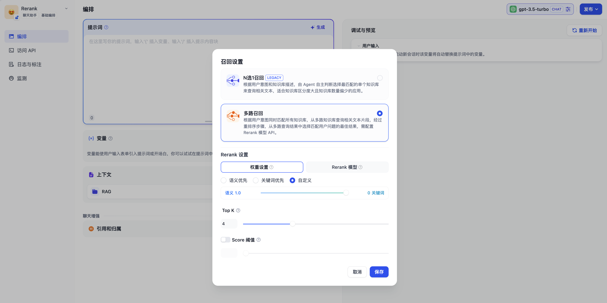

# 在应用上下文内引用知识库

### 1 创建知识库

知识库可以作为外部知识提供给大语言模型用于精确回复用户问题，你可以在 Dify 的[所有应用类型](../application\_orchestrate/#application\_type)内关联已创建的知识库。

以聊天助手为例，使用流程如下：

1. 进入 **工作室 -- 创建应用 --创建聊天助手**
2. 进入 **上下文设置** 点击 **添加** 选择已创建的知识库
3. 在 **上下文设置 -- 参数设置** 内配置**召回策略**
4. 在 **添加功能** 内打开 **引用和归属**&#x20;
5. 在 **调试与预览** 内输入与知识库相关的用户问题进行调试
6. 调试完成之后**保存并发布**为一个 AI 知识库问答类应用

<figure><figcaption>
在应用内关联知识库
</figcaption></figure>

***

### 2 引用知识库并指定召回模式

如果当前应用的上下文涉及多个知识库，需要设置召回模式以使得检索的内容更加精确。进入 **上下文 -- 参数设置 -- 召回设置**，选择知识库的召回模式。

- **N 选 1 召回（即将下线）**

N 选 1 召回由  Function Call/ReAct 进行驱动，每一个关联的知识库作为工具函数，LLM 会自主选择与用户问题最匹配的 1 个知识库来进行查询，**推理依据为用户问题与知识库描述的语义的匹配程度**。

<figure><figcaption></figcaption></figure>

虽然此方法无需配置 [Rerank](https://www.pinecone.io/learn/series/rag/rerankers/) 模型，但通过匹配知识库的关键词而实现的检索机制存在较大的误差。受限于实际效果，该功能将在 **2024 年第 3 季度下线**，推荐改用**多路召回**模式。

在 N 选 1 模式下，召回效果主要受三个因素影响：

* **系统推理模型的能力** 部分模型对于 Function Call/ReAct 的指令遵循程度不稳定
* **知识库描述是否清晰** 描述内容会影响 LLM 对用户问题与相关知识库的推理
* **知识库的个数** 知识库过多会影响 LLM 的推理精确性，同时可能会超出推理模型的上下文窗口长度。

**提升 N 选 1 模式推荐效果的方法：** 

- 选择效果更好的系统推理模型，关联尽量少的知识库，提供精确的知识库描述。

- 在知识库内上传文档内容时，系统推理模型将自动为知识库生成一个摘要描述。为了在该模式下获得最佳的召回效果，你可以在 “知识库->设置->知识库描述” 中查看到系统默认创建的摘要描述，并检查该内容是否可以清晰的概括知识库的内容。

- **多路召回（推荐）**

> 此方法需配置 [Rerank 模型](https://docs.dify.ai/v/zh-hans/getting-started/readme/features-and-specifications) ，检索效果更加精准。

根据用户意图同时检索已添加至 **“上下文”** 的知识库，从多路知识库查询相关文本片段。经过文本重排序（Rerank）后，在多路查询结果中选择最能够匹配用户问题的结果。

<figure><figcaption></figcaption></figure>

在多路召回模式下，检索器会在所有与应用关联的知识库中去检索与用户问题相关的文本内容，并将多路召回的相关文档结果合并，并通过后置的重排序（Rerank）步骤对检索召回的文档进行语义重排。

以下是多路召回模式的技术流程图：

<figure><figcaption></figcaption></figure>


多路召回模式下需要申请对应的 Rerank 模型的 API Key。


多路召回模式在多知识库检索时能够获得质量更高的召回效果，因此更**推荐将召回模式设置为多路召回**。

***

### 3 重排序（Rerank）

重排序模型通过将候选文档列表与用户问题语义匹配度进行重新排序，从而改进语义排序的结果。其原理是计算用户问题与给定的每个候选文档之间的相关性分数，并返回按相关性从高到低排序的文档列表。

<figure><figcaption>
混合检索+重排序
</figcaption></figure>

#### 配置 Rerank 模型 API

Dify 目前支持多个 Rerank 模型，进入 “模型供应商” 页填入 Rerank 模型的 API Key。

<figure><figcaption>
在模型供应商内配置 Rerank 模型
</figcaption></figure>


除了配置在线 Rerank 模型外，你也可以在配置本地推理框架如 Ollama、Xinference，并在推理框架内部署本地 Rerank 模型例如： bge-reranker。


#### 使用 Rerank 模型增强知识库引用效果

进入“编排->上下文->召回设置”页，调整召回设置。

在知识库内使用 Rerank 模型有助于提升文本应用效果，详细说明请参考[《检索设置》](https://docs.dify.ai/v/zh-hans/guides/knowledge-base/create_knowledge_and_upload_documents#id-6-jian-suo-she-zhi)。

你也可以在应用编排的上下文召回设置内调整 Rerank 设置，优化多个知识库之间的检索效果。

**权重设置**

> 该设置无需添加 Rerank API。

提供介于语义和关键词匹配之间的调整设置。语义指的是在知识库内进行向量检索，关键词匹配指的是在知识库内进行全文检索（Full Text Search）。你可以在设置内调整两者之间的权重。

--- 

**Rerank 模型**

> 该设置需要在[模型供应商](https://docs.dify.ai/v/zh-hans/getting-started/readme/model-providers)内添加 Rerank API。

重排序模型将根据候选文档列表与用户问题语义匹配度进行重新排序，从而改进语义排序的结果。

#### 可调参数

- **TopK**
  
  用于筛选与用户问题相似度最高的文本片段。系统同时会根据选用模型上下文窗口大小动态调整分段数量。

- **Score 阈值**
  
  用于设置文本片段筛选的相似度阈值。

### 常见问题

引用多个知识库时，无法调整**权重设置**，提示以下错误：

出现此问题是因为上下文内所引用的多个知识库内所使用的嵌入模型（Embedding）不一致，为避免检索内容冲突而出现此提示。推荐设置在“模型供应商”内设置并启用 Rerank 模型，或者统一知识库的检索设置。

