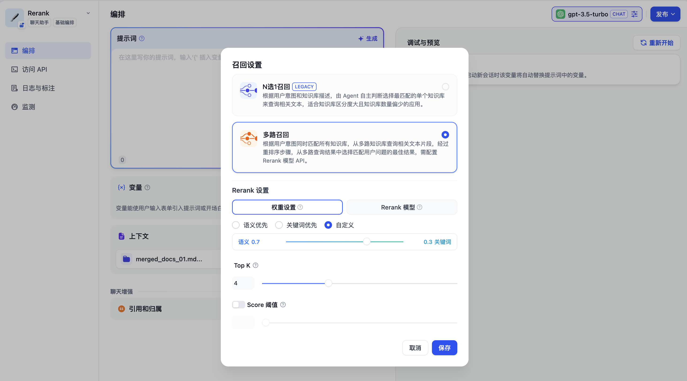

# 在应用内集成知识库

### 1 创建知识库

知识库可以作为外部知识提供给大语言模型用于精确回复用户问题，你可以在 Dify 的[所有应用类型](../application\_orchestrate/#application\_type)内关联已创建的知识库。

以聊天助手为例，使用流程如下：

1. 进入 **工作室 -- 创建应用 --创建聊天助手**
2. 进入 **上下文设置** 点击 **添加** 选择已创建的知识库
3. 在 **上下文设置 -- 参数设置** 内配置**召回策略**
4. 在 **添加功能** 内打开 **引用和归属**&#x20;
5. 在 **调试与预览** 内输入与知识库相关的用户问题进行调试
6. 调试完成之后**保存并发布**为一个 AI 知识库问答类应用

<figure><figcaption>
在应用内关联知识库
</figcaption></figure>

***

### 2 指定上下文所使用的召回模式

如果当前应用的上下文涉及多个知识库，需要设置召回模式以使得检索的内容更加精确。进入 **上下文 -- 参数设置 -- 召回设置**，选择知识库的召回模式。

- **N 选 1 召回（即将下线）**

> 此方法无需配置 [Rerank](https://www.pinecone.io/learn/series/rag/rerankers/) 模型。受限于实际效果，该功能将在 2024 年第 3 季度下线。

N 选 1 召回由  Function Call/ReAct 进行驱动，每一个关联的知识库作为工具函数，LLM 会自主选择与用户问题最匹配的 1 个知识库来进行查询，**推理依据为用户问题与知识库描述的语义的匹配程度**。

召回效果主要受三个因素影响：

* **系统推理模型的能力** 部分模型对于 Function Call/ReAct 的指令遵循程度不稳定
* **知识库描述是否清晰** 描述内容会影响 LLM 对用户问题与相关知识库的推理
* **知识库的个数** 知识库过多会影响 LLM 的推理精确性，同时可能会超出推理模型的上下文窗口长度。

**N 选 1 模式的推荐配置方法：** 选择效果更好的系统推理模型，关联尽量少的知识库，提供精确的知识库描述。

用户上传知识库时，系统推理模型将自动为知识库生成一个摘要描述。为了在该模式下获得最佳的召回效果，你可以在“知识库->设置->知识库描述”中查看到系统默认创建的摘要描述，并检查该内容是否可以清晰的概括知识库的内容。

以下是 N 选 1 召回模式的技术流程图：

<figure><figcaption></figcaption></figure>


N 选 1 召回依赖模型的推理能力，使用限制较多，计划在 2024 Q3 调整该模式的召回策略。


- **多路召回（推荐）**

> 此方法需配置 [Rerank 模型](https://docs.dify.ai/v/zh-hans/getting-started/readme/features-and-specifications) ，检索效果更加精准。

根据用户意图同时检索已添加至 **“上下文”** 的知识库，从多路知识库查询相关文本片段。经过文本重排序（Rerank）后，在多路查询结果中选择最能够匹配用户问题的结果。

<figure><figcaption></figcaption></figure>

在多路召回模式下，检索器会在所有与应用关联的知识库中去检索与用户问题相关的文本内容，并将多路召回的相关文档结果合并，并通过后置的重排序（Rerank）步骤对检索召回的文档进行语义重排。

以下是多路召回模式的技术流程图：

<figure><figcaption></figcaption></figure>


多路召回模式下需要配置 Rerank 模型。


多路召回模式不依赖于模型的推理能力或知识库描述，该模式在多知识库检索时能够获得质量更高的召回效果，因此更**推荐将召回模式设置为多路召回**。

***

### 3 重排序（Rerank）

重排序模型通过将候选文档列表与用户问题语义匹配度进行重新排序，从而改进语义排序的结果。其原理是计算用户问题与给定的每个候选文档之间的相关性分数，并返回按相关性从高到低排序的文档列表。

<figure><figcaption>
混合检索+重排序
</figcaption></figure>


想了解更多关于 Rerank 的相关知识，请查阅扩展阅读[重排序](https://www.pinecone.io/learn/series/rag/rerankers/)。


#### 配置 Rerank 模型 API

Dify 目前支持多个 Rerank 模型，进入“模型供应商” 页填入 Rerank 模型的 API Key：

<figure><figcaption>
在模型供应商内配置 Rerank 模型
</figcaption></figure>


除了配置在线 Rerank 模型外，你也可以在配置本地推理框架如 Ollama、Xinference，并在推理框架内部署本地 Rerank 模型例如： bge-reranker。


#### 应用 Rerank 模型

进入“知识库->创建知识库->检索设置”页面并在添加 Rerank 设置。

除了在创建知识库时设置 Rerank 参数，你也可以在已创建的知识库设置内更改 Rerank 配置，或者是在应用编排的上下文召回模式设置中更改 Rerank 配置。

<figure><figcaption>
数据集检索模式中设置 Rerank 模型
</figcaption></figure>

**TopK**：用于设置 Rerank 后返回相关文档的数量，筛选与用户问题较高相似度的文本片段，动态调整分段数量。

**Score 阈值**：用于设置 Rerank 后返回相关文档的最低分值。设置 Rerank 模型后，TopK 和 Score 阈值设置仅在 Rerank 步骤生效。

**权重设置**：提供介于语义和关键词匹配之间的调整设置。

进入“提示词编排->上下文->召回设置”页，指定 Rerank 设置。

<figure><figcaption>
数据集多路召回模式中的 Rerank 设置
</figcaption></figure>
