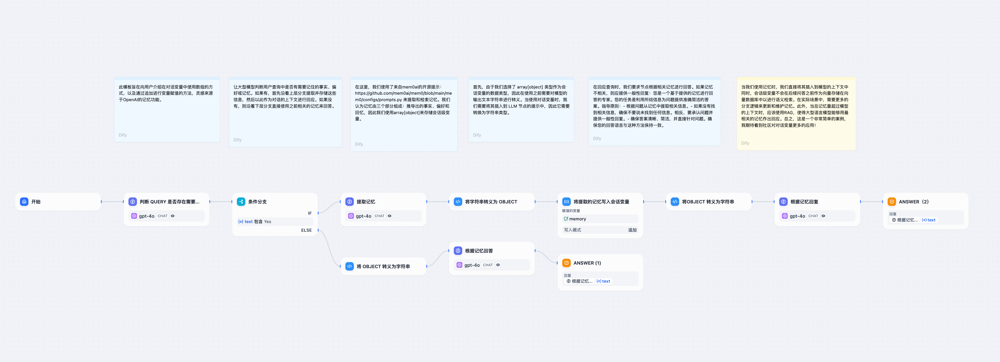

# HTTP 请求

### 定义

允许通过 HTTP 协议发送服务器请求，适用于获取外部数据、webhook、生成图片、下载文件等情景。它让你能够向指定的网络地址发送定制化的 HTTP 请求，实现与各种外部服务的互联互通。

该节点支持常见的 HTTP 请求方法：

* **GET**，用于请求服务器发送某个资源。
* **POST**，用于向服务器提交数据，通常用于提交表单或上传文件。
* **HEAD**，类似于 GET 请求，但服务器不返回请求的资源主体，只返回响应头。
* **PATCH**，用于在请求-响应链上的每个节点获取传输路径。
* **PUT**，用于向服务器上传资源，通常用于更新已存在的资源或创建新的资源。
* **DELETE**，用于请求服务器删除指定的资源。

你可以通过配置 HTTP 请求的包括 URL、请求头、查询参数、请求体内容以及认证信息等。&#x20;

<figure><figcaption>
HTTP 请求配置
</figcaption></figure>

***

### 场景

* **将应用互动内容发送至特定服务器**

你可以在 HTTP 请求的不同部分动态插入变量。例如在处理客户评价请求时，可以将用户名或客户 ID、评价内容等变量嵌入到请求中，以定制化自动回复信息或获取特定客户信息并发送相关资源至特定的服务器。

<figure><figcaption>
客户评价分类
</figcaption></figure>

HTTP 请求的返回值包括响应体、状态码、响应头和文件。值得注意的是，如果响应中包含了文件，这个节点能够自动保存文件，供流程后续步骤使用。这样不仅能提高处理效率，也可以更加简单直接地处理带有文件的响应。

* **发送文件**

你可以使用 HTTP PUT 请求将应用内的文件发送至其它 API 服务。在请求的 Body 中，可以在 `binary` 内选中文件变量。这种方式常用于文件传输、文档存储或媒体处理等场景。

示例： 假设你正在开发一个文档管理应用，需要将用户上传的 PDF 文件同步发送第三方服务，可以通过 HTTP 请求节点通过文件变量进行传递。

配置示例如下：

<figure><figcaption>
通过 HTTP 节点发送文件
</figcaption></figure>

